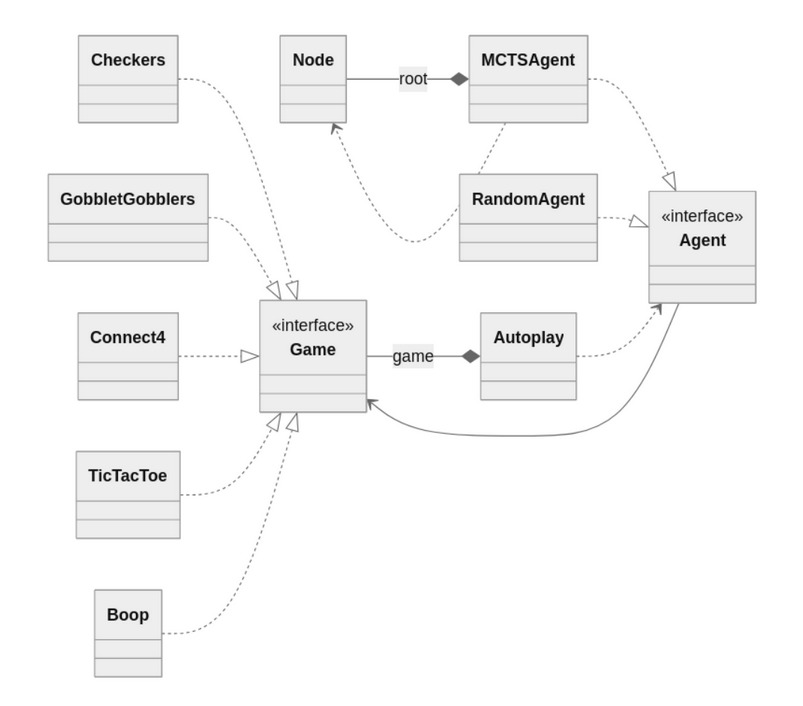
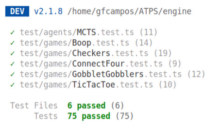
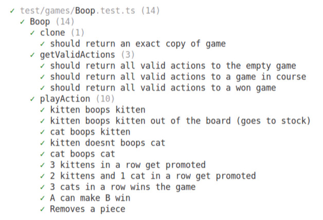

## Automated Playtest System - ATPS

Sistema que faz testagem automática de protótipos de jogos de tabuleiro, permitindo que parte 
dos onerosos e demorados testes humanos sejam substituídos durante a fase de desenvolvimento.
O TCC para o qual este sistema foi desenvolvido pode ser encontra neste [link](https://tinyurl.com/tcc-gustavo-campos).

Ainda foram implementados 5 protótipos de jogos, de crescente complexidade:
- Jogo da Velha
- Connect4
- Gobblet Gobblers
- Damas
- Boop

## Visão Geral do Sistema

O sistema foi desenvolvido de forma a permitir que diferentes jogos e perfis de
agentes se comunicassem de forma transparente com a classe do Autoplay, que é responsável
por realizar o playtest automatizado. Sua estrutura é apresentada pelo diagrama de classes
abaixo.

Para permitir a implementação do MCTS, foi criada uma classe Node e uma
classe MCTSAgent que representam, respectivamente, seus nós e sua árvore, de forma
que permitisse a realização da seleção, expansão, simulação, retropropagação e a posterior
escolha da melhor ação. O agente que faz movimentos aleatórios foi representado pela
classe RandomAgent e também será usado nas avaliações.

Para permitir o uso da implementação dos jogos pelo agente aleatório e agente
MCTS, foi criada um interface para os jogos, que permitisse para dado jogo: obter as ações
permitidas; realizar uma ação; criar uma cópia do jogo; obter o jogador atual e o anterior;
verificar se o jogo terminou e obter o vencedor.

Para garantir que a implementação dos jogos obedeçam às regras reais, que as buscas
operem de acordo com o esperado, e também para facilitar as refatorações necessárias, um
conjunto de testes unitários foi criado. A primeira figura abaixo exibe o resumo dos testes 
feitos sobre o sistema, e a outra figura, como exemplo, exibe de forma mais detalhada os 
testes feitos para o jogo Boop.

### Registro de dados sobre os jogos e as árvore expandidas

O sistema foi implementado de forma que fosse capaz de coletar diversos dados sobre
as partidas, e escrevê-los em arquivos no formato json. Sobre o placar, foram registrados:
vitórias do primeiro jogador; vitórias do segundo jogador e empates. Sobre o curso do jogo
foi registrado: quantidade média de turnos por partida; duração média da partida e duração
média do turno. E sobre as árvores expandida pelo MCTS, foi registrado: quantidade
média de buscas por árvore; quantidade média de nós por árvore e média de profundidade
máxima atingida nas árvores.

