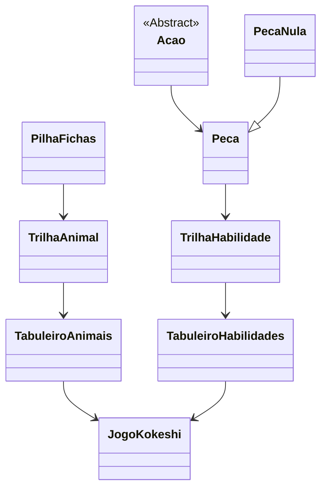

# Kokeshi

```mermaid
classDiagram

    class JogoKokeshi

    class TabuleiroHabilidades
    class TrilhaHabilidade
    
    class PilhaFichas
    class TrilhaAnimal
    class TabuleiroAnimais 
    
    class Peca

    class Acao {
        <<Abstract>>
    }

    PilhaFichas --> TrilhaAnimal 
    TrilhaAnimal --> TabuleiroAnimais
    TabuleiroAnimais --> JogoKokeshi


    Peca --> TrilhaHabilidade
    TrilhaHabilidade --> TabuleiroHabilidades
    TabuleiroHabilidades --> JogoKokeshi

    Acao --> Peca
    PecaNula --|> Peca
```
