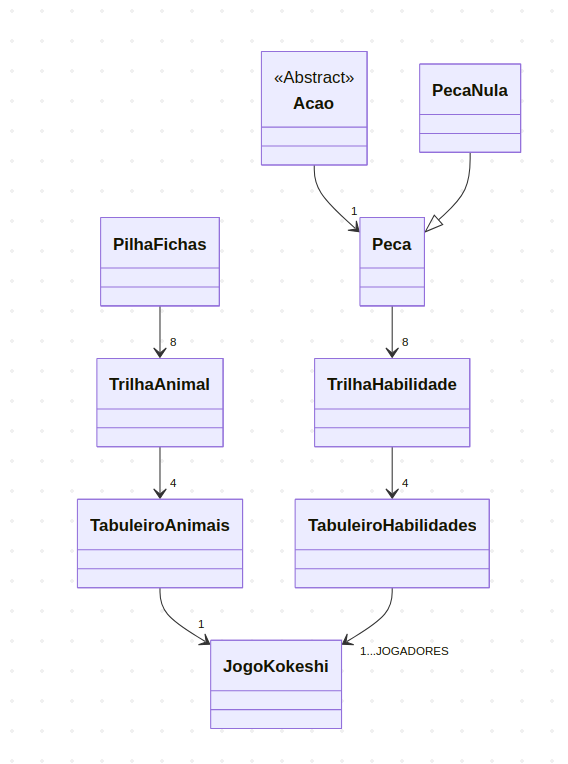
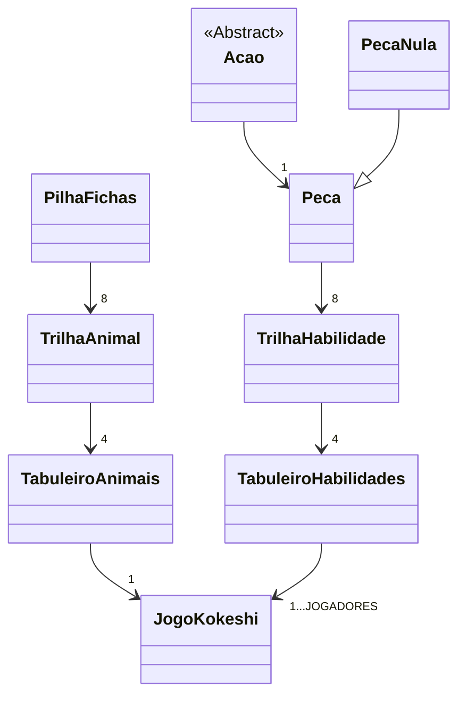

# Kokeshi

## Diagrama de Classes

```mermaid
classDiagram

    class JogoKokeshi

    class TabuleiroHabilidades
    class TrilhaHabilidade
    
    class PilhaFichas
    class TrilhaAnimal
    class TabuleiroAnimais 
    
    class Peca

    class Acao {
        <<Abstract>>
    }

    PilhaFichas --> "8" TrilhaAnimal 
    TrilhaAnimal --> "4" TabuleiroAnimais
    TabuleiroAnimais --> "1" JogoKokeshi


    Peca --> "8" TrilhaHabilidade
    TrilhaHabilidade --> "4" TabuleiroHabilidades
    TabuleiroHabilidades --> "1...JOGADORES" JogoKokeshi

    Acao --> "1" Peca
    PecaNula --|> Peca
```
